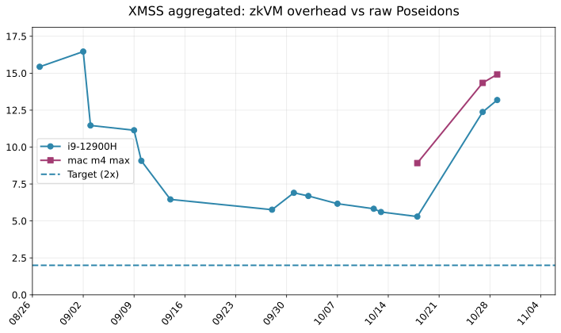

<h1 align="center">♦ leanMultisig ♦</h1>

XMSS + minimal [zkVM](minimal_zkVM.pdf) = lightweight PQ signatures, with unbounded aggregation


## Proving System


- [WHIR](https://eprint.iacr.org/2024/1586.pdf)
- [SuperSpartan](https://eprint.iacr.org/2023/552.pdf), with AIR-specific optimizations developed by W. Borgeaud in [A simple multivariate AIR argument inspired by SuperSpartan](https://solvable.group/posts/super-air/#fnref:1)
- [Univariate Skip](https://eprint.iacr.org/2024/108.pdf)
- [Logup*](https://eprint.iacr.org/2025/946.pdf)
- ...

The VM design is inspired by the famous [Cairo paper](https://eprint.iacr.org/2021/1063.pdf).

## Benchmarks

Benchmarks are performed on 2 laptops:
- i9-12900H, 32 gb of RAM
- mac m4 max

target ≈ 128 bits of security, currently using conjecture: 4.12 of [WHIR](https://eprint.iacr.org/2024/1586.pdf), "up to capacity" (TODO: provable security)

### Poseidon2

Poseidon2 over 16 KoalaBear field elements.

```console
RUSTFLAGS='-C target-cpu=native' cargo run --release -- poseidon --log-n-perms 20
```


### Recursion


The full recursion program is not finished yet. Instead, we prove validity of a WHIR opening, with 25 variables, and rate = 1/4.

```console
RUSTFLAGS='-C target-cpu=native' cargo run --release -- recursion
```


### XMSS aggregation

```console
RUSTFLAGS='-C target-cpu=native' cargo run --release -- xmss --n-signatures 800
```

[Trivial encoding](docs/XMSS_trivial_encoding.pdf) (for now).




### Proof size

With conjecture "up to capacity", current proofs with rate = 1/2 are about ≈ 400 - 500 KiB, of which ≈ 300 KiB comes from WHIR.

- The remaining 100 - 200 KiB will be significantly reduced in the future (this part has not been optimized at all).
- WHIR proof size will also be reduced, thanks to merkle pruning (TODO).

Target: 256 KiB for fast proof, 128 KiB for slower proofs (rate = 1/4 or 1/8).

## Credits

- [Plonky3](https://github.com/Plonky3/Plonky3) for its various performant crates (Finite fields, poseidon2 AIR etc)
- [whir-p3](https://github.com/tcoratger/whir-p3): a Plonky3-compatible WHIR implementation
- [Whirlaway](https://github.com/TomWambsgans/Whirlaway): Multilinear snark for AIR + minimal zkVM


