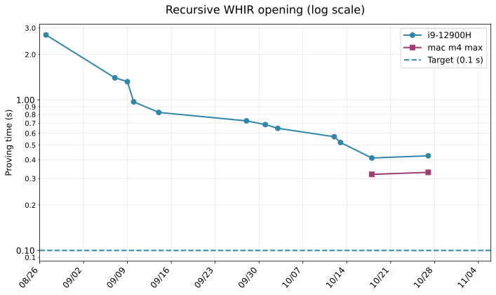

<h1 align="center">♦ leanMultisig ♦</h1>

XMSS + Simple [zkVM](minimal_zkVM.pdf) = PQ signatures, with unbounded aggregation

## AIR Proving System

The protocol is detailed in [Whirlaway.pdf](Whirlaway.pdf)

The core argument builds upon [SuperSpartan](https://eprint.iacr.org/2023/552.pdf) (Srinath Setty, Justin Thaler, Riad Wahby), with AIR-specific optimizations developed by William Borgeaud in [A simple multivariate AIR argument inspired by SuperSpartan](https://solvable.group/posts/super-air/#fnref:1).

Key techniques:

- AIR table committed as a single multilinear polynomial
- Sumcheck + "Univariate Skip" from [Some Improvements for the PIOP for ZeroCheck](https://eprint.iacr.org/2024/108.pdf) (Angus Gruen)

## Benchmarks

cpu: i9-12900H, ram: 32 gb

> TLDR: Very slow, **but there is hope** (cf [TODO](TODO.md))

### Poseidon2

`RUSTFLAGS='-C target-cpu=native' cargo run --release`

50 % over 16 field elements, 50 % over 24 field elements. rate = 1/2

### Recursion

`RUSTFLAGS='-C target-cpu=native' cargo test --release --package rec_aggregation --lib -- recursion::test_whir_recursion --nocapture`

The full recursion program is not finished yet. Instead, we prove validity of a WHIR opening, with 25 variables, and rate = 1/4.

### XMSS aggregation

`RUSTFLAGS='-C target-cpu=native' NUM_XMSS_AGGREGATED='500' cargo test --release --package rec_aggregation --lib -- xmss_aggregate::test_xmss_aggregate --nocapture --ignored`

500 XMSS aggregated. "Trivial encoding" (for now).

## Credits

- [Plonky3](https://github.com/Plonky3/Plonky3) for its various performant crates (Finite fields, poseidon2 AIR etc)
- [whir-p3](https://github.com/tcoratger/whir-p3): a Plonky3-compatible WHIR implementation
- [Whirlaway](https://github.com/TomWambsgans/Whirlaway): Multilinear snark for AIR + minimal zkVM
